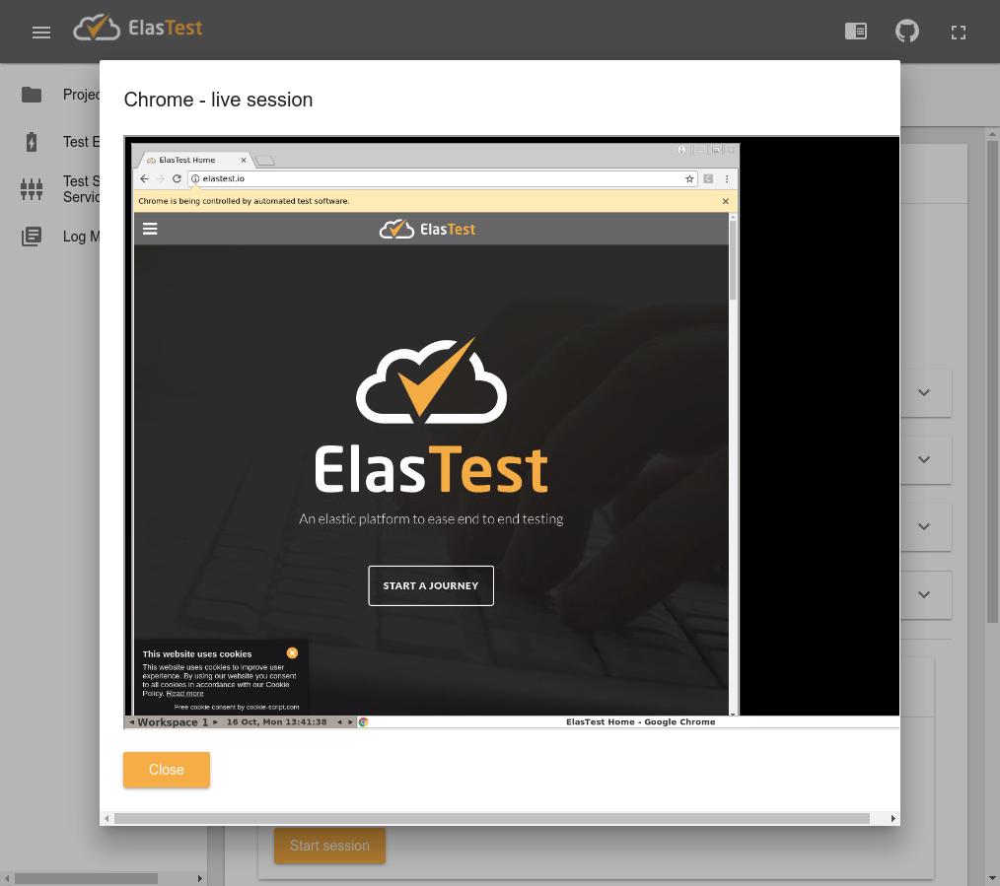

# End-to-end tests of ElasTest User Emulator Service (EUS)

This project contains several end-to-end (E2E) test aimes to verify the correctness of the ElasTest User Emulator Service (EUS) through the Test Orchestration and Recommendation Manager (TORM).

In order to implement these test we use [Selenium WebDriver], which is an web testing framework to automate the navigation and verification of web applications using a given test logic. In this case, we use Java to implement the test, and [JUnit 5] as base testing framework. In order to ease the management on web browsers in the tests, we use an open source JUnit 5 extension called [selenium-jupiter].

Two different E2E are going to be implemented:

1. Use of EUS as support service.

2. Use of EUS as TJob.

The following sections of this document summarizes the main parts of these tests.

## Use of EUS as support service

This test in implemented in the test [EusSupportServiceE2eTest.java]. As can be seen, this class extends a parent class: [EusBaseTest.java]. This parent class contains a common setup for tests (annotated with JUnit 5's `@BeforeEach`) and also a common teardown (annotated with JUnit 5's `@AfterEach`):

```java
    @BeforeEach
    void setup() {
        String etmApi = getProperty("etEmpApi");
        if (etmApi != null) {
            tormUrl = etmApi;
        }
        log.info("Using URL {} to connect to TORM", tormUrl);
    }
```

This piece of code read the JVM argument called `etEmpApi` to find out the TORM URL. The value of this argument is supposed to be configured previously to the test execution, and this is done in the [Jenkins pipeline]:

```
stage ("E2E tests") {
   try {
      sh "cd e2e-test; mvn -B clean test -DetEmpApi=http://${etEmpApi}:37000/"
   } catch(e) {
      sh 'docker ps | awk "{print $NF}" | grep eus | xargs docker logs'
   }
   step([$class: 'JUnitResultArchiver', testResults: '**/target/surefire-reports/TEST-*.xml'])
}
```

The parent class [EusBaseTest.java] also defines a common teardown logic (method annotated with JUnit 5's `@AfterEach`):

```java
    @AfterEach
    void teardown() throws IOException {
        if (driver != null) {
            log.info("Screenshot (in Base64) at the end of the test:\n{}",
                    getBase64Screenshot(driver));
        }
    }
```

This code is used for logging and debugging purposes. The objective is to trace to E2E tests, which as you might experienced, are difficult per nature (in fact making this process more easy for developers and testers is one of the main objectives of ElasTest). At this stage of the project, we use the capability provided by Selenium WebDriver to get screeshots of the web application under test, logging it as a Base64 string. This string can be later recover from the Jenkins logs, and this string can be directly pasted in a web browser as watched as a PNG picture. For example:   




Regarding the end-to-end test, its structure is as follows:


```java
@Tag("e2e")
@DisplayName("E2E tests of EUS through TORM")
@ExtendWith(SeleniumExtension.class)
public class EusSupportServiceE2eTest extends EusBaseTest {

    final Logger log = getLogger(lookup().lookupClass());

    @Test
    @DisplayName("EUS as support service")
    void testSupportService(ChromeDriver driver) throws Exception {
        // Test logic
    }

}
```

The actual test is coded in the method annotated with JUnit 5's annotation `@Test`. In this method, in addition to the JUnit 5 annotation for tagging and naming (`@Tag` and `@DisplayName`), we see that we are using the [selenium-jupiter] extension, declared by means of the annotation `@ExtendWith(SeleniumExtension.class)`. Thanks to the dependency injection feature of JUnit 5, the extension creates proper WebDriver instances for tests. In this case, simply declaring this instance in the test arguments (in this case, `ChromeDriver driver`), we can use a browser (in this case Chrome) in our test is a seamless way. The Jenkins job is configured properly to use a Docker image ([elastest/ci-docker-e2e]) in which several browsers (Chrome and Firefox) are ready to be used by tests.

Regarding the test logic, it is basically an specific application of Selenium WebDriver to test the web GUI provided by the TORM. For instance, the first part of the test is the following:

```java
        log.info("Navigate to TORM and start support service");
        driver.manage().window().setSize(new Dimension(1024, 1024));
        driver.manage().timeouts().implicitlyWait(5, SECONDS); // implicit wait
        driver.get(tormUrl);
        startTestSupportService(driver, "EUS");
```

In this snippet, we see that we force the size of the browser windows, we configure a global implicit wait of 5 seconds (to wait for elements to be located by WebDriver), then we open the TORM URL, and then we use the parent method `startTestSupportService` to start the support service identified by the label `EUS`.

The next part is specific for the EUS GUI. First, we click on the Chrome radio button and start a live session:

```java
        log.info("Select Chrome as browser and start session");
        driver.findElement(By.id("chrome_radio")).click();
        driver.findElement(By.id("start_session")).click();

```

Then we need to create an explicit wait for the iframe to be available. This operation can be time-consuming, since the Chrome Docker image needs to be downloaded, and the first time we make a pull (and this is very likely to happen in Jenkins) can last a couple of minutes.

```java
        log.info("Wait to load browser");
        By iframe = By.id("eus_iframe");
        WebDriverWait waitBrowser = new WebDriverWait(driver, 240); // seconds
        waitBrowser.until(visibilityOfElementLocated(iframe));
        driver.switchTo().frame(driver.findElement(iframe));
```

After that, we move to the EUS iframe, interacting with the HTML5 Canvas in which the browser session is displayed to the user. The simulate a 5 seconds session (just to be able to make a brief recording, which is used in the next steps). 

```java
        log.info("Click browser navigation bar and navigate");
        WebElement canvas = driver.findElement(By.id("noVNC_canvas"));
        new Actions(driver).moveToElement(canvas, 142, 45).click().build()
                .perform();
        canvas.sendKeys("elastest.io" + RETURN);
        int navigationTimeSec = 5;
        log.info("Waiting {} secons (simulation of manual navigation)",
                navigationTimeSec);
        sleep(SECONDS.toMillis(navigationTimeSec));
```

The rest of the test follows the same guidelines, i.e. the use of WebDriver API to interact with the GUI, explicit waits when needed, and logging screenshots for debugging purposes. 

## Use of EUS as TJob

This test follows the same approach that the previous one. Inspecting the code of the test (class [EusTJobE2eTest.java]) we can see three parts. First, we open the TORM URL and use the method `createNewProject` (defined in the parent class, [EusBaseTest.java]) to create a new project in TORM: 

```java
        log.info("Navigate to TORM and start new project");
        driver.manage().window().setSize(new Dimension(1024, 1024));
        driver.manage().timeouts().implicitlyWait(5, SECONDS);
        driver.get(tormUrl);
        createNewProject(driver, "my-test-project");
```

Then we create a new TJob filling the form with test values:

```java
        log.info("Create new TJob using EUS");
        driver.findElement(By.xpath("//button[contains(string(), 'New TJob')]"))
                .click();
        driver.findElement(By.name("tJobName")).sendKeys("my-test-tjob");
        driver.findElement(By.name("tJobImageName"))
                .sendKeys("elastest/ci-docker-e2e");
        driver.findElement(By.name("resultsPath")).sendKeys(
                "/home/jenkins/elastest-user-emulator-service/tjob-test/target/surefire-reports/TEST-io.elastest.eus.test.e2e.TJobEusTest.xml");
        driver.findElement(By.className("mat-select-trigger")).click();
        driver.findElement(By.xpath("//md-option[contains(string(), 'None')]"))
                .click();
        driver.findElement(By.className("mat-slide-toggle-bar")).click();
        driver.findElement(By.name("commands")).sendKeys(
                "git clone https://github.com/elastest/elastest-user-emulator-service; cd elastest-user-emulator-service/tjob-test; mvn test;");
        driver.findElement(By.xpath("//md-checkbox[contains(string(), 'EUS')]"))
                .click();
        driver.findElement(By.xpath("//button[contains(string(), 'SAVE')]"))
                .click();
```

Finally we execute the TJob, asserting that the the EUS GUI is present, and also the proper traces in the logging view. These operations can be time-consuming, and therefore, we need to implement explicit wait using the WebDriver API (`WebDriverWait`):

```java
        log.info("Run TJob and wait for EUS GUI");
        driver.findElement(By.xpath("//button[@title='Run TJob']")).click();
        By eusCard = By
                .xpath("//md-card-title[contains(string(), 'elastest-eus')]");
        WebDriverWait waitEus = new WebDriverWait(driver, 60);
        waitEus.until(visibilityOfElementLocated(eusCard));

        log.info("Wait for build sucess traces");
        WebDriverWait waitLogs = new WebDriverWait(driver, 120);
        waitLogs.until(textToBePresentInElementLocated(By.tagName("logs-view"),
                "BUILD SUCCESS"));
```

[Selenium WebDriver]: http://www.seleniumhq.org/projects/webdriver/
[JUnit 5]: http://junit.org/junit5/docs/current/user-guide/
[selenium-jupiter]: https://bonigarcia.github.io/selenium-jupiter/
[EusSupportServiceE2eTest.java]: https://github.com/elastest/elastest-user-emulator-service/blob/master/e2e-test/src/test/java/io/elastest/eus/test/e2e/EusSupportServiceE2eTest.java
[EusTJobE2eTest.java]: https://github.com/elastest/elastest-user-emulator-service/blob/master/e2e-test/src/test/java/io/elastest/eus/test/e2e/EusTJobE2eTest.java
[EusBaseTest.java]: https://github.com/elastest/elastest-user-emulator-service/blob/master/e2e-test/src/test/java/io/elastest/eus/test/base/EusBaseTest.java
[Jenkins pipeline]: https://github.com/elastest/elastest-user-emulator-service/blob/master/e2e-test/Jenkinsfile
[elastest/ci-docker-e2e]: https://hub.docker.com/r/elastest/ci-docker-e2e/
